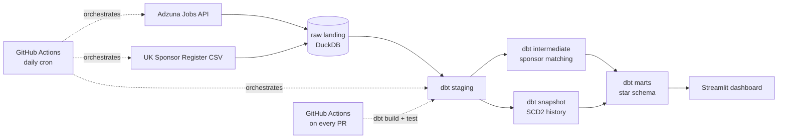

# UK Data & Analytics Jobs Pipeline

A daily-refreshed analytics engineering pipeline that tracks UK data/analytics job postings and cross-references employers against the UK Home Office's official register of licensed visa sponsors — answering a real question ("who's actually hiring, and can they legally sponsor a visa?") rather than modeling a toy dataset.

**Live dashboard:** _[add your Streamlit Community Cloud link here once deployed]_
**dbt docs / data lineage:** _[add your GitHub Pages link here once the daily_refresh workflow runs once]_

## Why this project

Most analytics engineering portfolios fork the dbt `jaffle-shop` tutorial. This one ingests two real, live, freely-available sources and models them into a proper dimensional warehouse:

1. **[Adzuna Jobs API](https://developer.adzuna.com/)** — live UK job postings for analytics/data roles (free developer tier, official API, no scraping).
2. **[UK Home Office Register of Licensed Sponsors: Workers](https://www.gov.uk/government/publications/register-of-licensed-sponsors-workers)** — the government's actual list of organisations licensed to sponsor Skilled Worker visas, re-downloaded on every run.

The sponsor-matching step specifically replaces a naive/ML "mentions sponsorship" text signal (which, in an earlier prototype of this idea, returned **zero correct matches** for UK postings — it turned out to be biased toward US H1B phrasing) with a deterministic match against the real government register. See [`docs/sponsor_matching_notes.md`](docs/sponsor_matching_notes.md) for the false-positive lessons that shaped the matching logic.

## Architecture



## Tech stack

| Layer | Tool | Why |
|---|---|---|
| Ingestion | Python + `requests` | Adzuna REST API + gov.uk CSV download |
| Warehouse | DuckDB | Free, zero-infra, runs in CI — swappable to Snowflake/BigQuery via `profiles.yml` (config change, not a rewrite) |
| Transformation | dbt-core | Staging → intermediate → marts, tests, docs, snapshots |
| History (SCD2) | dbt snapshots | Tracks how long postings stay open, salary/title changes over time |
| Orchestration | GitHub Actions (scheduled) | Daily ingestion + dbt run + docs publish — no paid orchestrator needed for this scale |
| CI/CD | GitHub Actions (on PR) | `dbt build`/`dbt test` against seed fixtures — passes with zero secrets, so it works for anyone who forks this |
| Testing | dbt tests + `dbt-utils` + `dbt-expectations` | Schema tests, custom singular tests, source freshness checks |
| Semantic layer | dbt MetricFlow (stretch goal) | Standardized metrics: posting volume, median salary, sponsor rate |
| Visualization | Streamlit + Plotly | Deployed free on Streamlit Community Cloud |

## Data model

Star schema, grain of `fct_job_postings` is one row per posting per day observed active (derived from the SCD2 snapshot):

```
dim_company ──┐
dim_location ─┼─► fct_job_postings ◄─┐
dim_date ─────┘                       │
                          bridge_posting_skill ─── dim_skill
```

## Repo structure

```
.
├── PROJECT_PLAN.md          # full build roadmap, phased, with learning resources
├── ingest/                  # Python: pulls from Adzuna + UK sponsor register
├── models/
│   ├── staging/             # 1:1 cleaned views over raw sources
│   ├── intermediate/        # sponsor-matching business logic
│   └── marts/                # star schema: fct_job_postings, dim_*, bridge_*
├── snapshots/                # SCD2 history of job postings
├── seeds/                    # fixture data (CI) + curated sponsor match lookup
├── dashboard/                # Streamlit app
├── docs/                     # sponsor-matching methodology notes
└── .github/workflows/        # ci.yml (PR gate) + daily_refresh.yml (production)
```

## Running it

**Zero-setup path (what CI runs):**
```bash
pip install -r requirements.txt
cp profiles.yml.example profiles.yml
dbt deps
dbt seed --target ci
dbt build --target ci
```
This builds the full star schema against fixture data captured from real (verified) postings — no API keys needed.

**Live path (what the daily GitHub Action runs):**
```bash
export ADZUNA_APP_ID=...   # free signup: https://developer.adzuna.com/
export ADZUNA_APP_KEY=...
python -m ingest.adzuna_client
python -m ingest.sponsor_register
python -m ingest.load_to_duckdb
dbt snapshot --target dev
dbt build --target dev
streamlit run dashboard/app.py
```

## Engineering decisions worth reading

- **Why DuckDB, not Snowflake/BigQuery** — this is a portfolio project, not production infrastructure. DuckDB means anyone (including a recruiter) can clone this and run the full pipeline in under a minute with zero cloud account. The `profiles.yml` structure demonstrates the swap to a real warehouse is a config change.
- **Why dbt snapshots for history instead of an append-only raw table** — keeps the raw layer representing current state (simpler upserts) while getting full SCD2 history for free from a well-understood dbt primitive, rather than hand-rolling merge/history logic.
- **Why a curated sponsor-match seed instead of pure fuzzy matching** — see [`docs/sponsor_matching_notes.md`](docs/sponsor_matching_notes.md). Short version: naive substring matching against a 140,000-row government register produces confident-looking false positives; precision mattered more than full automation here.
- **What I'd do differently at scale** — the skill-extraction step (`bridge_posting_skill`) uses a cross-join + regex match, which is fine at this data volume but wouldn't be how I'd approach it with millions of postings (I'd push extraction into ingestion or use a text-search index).

## Status / roadmap

See [`PROJECT_PLAN.md`](PROJECT_PLAN.md) for the full phased build plan. Current state: _[update this as you build — e.g. "Phases 0-3 complete, Phase 4 (sponsor matching) in progress"]_.

## License

MIT — see [`LICENSE`](LICENSE).
